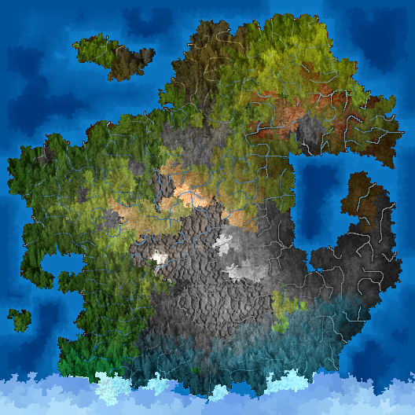

# Map maker for Dwarffortress

This is the linux counterpart of this
[script](http://dffd.bay12games.com/file.php?id=4359).

The Gimp script was *NOT* written by me.

## Requirements:

- Gimp (to make the beautiful map)
- ImageMagick (for converting into jpg OPTIONAL)

## How to use:

1. Install the gimp script by copying `DwarfMapMaker.scm` into
`/usr/share/gimp/2.0/scripts`
2. Copy your `*.bmp` files from the dwarffortress export into this folder.
3. Run `./create.sh`

## How does it look like?

